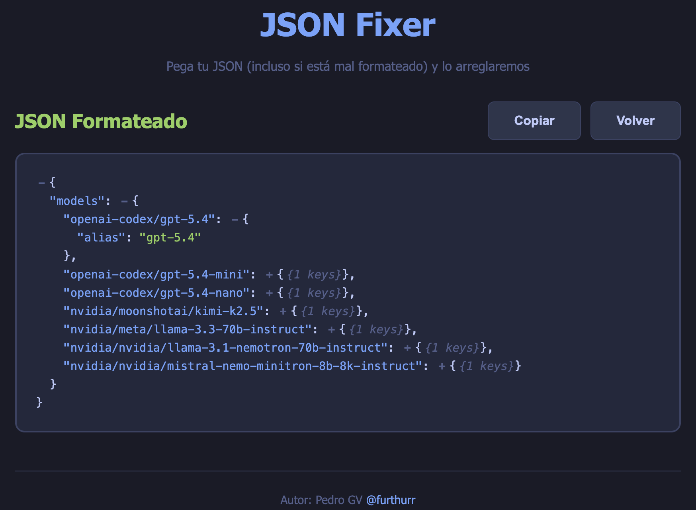

# JSON Fixer

Una herramienta web para reparar y formatear JSON malformado desde el navegador.



## Descripcion

JSON Fixer permite pegar respuestas que parecen JSON pero vienen incompletas o mal escritas, intenta corregir su estructura sin cambiar los datos y muestra el resultado en una vista legible, coloreada y facil de copiar.

## Que hace

- Corrige claves sin comillas
- Convierte comillas simples a dobles
- Agrega comillas a strings sin comillas
- Soporta strings complejos con espacios, acentos, UUIDs, URLs, telefonos y colores hex
- Repara elementos de arrays sin comillas
- Convierte propiedades vacias como `extension:` en `""`
- Elimina comas finales antes de `}` o `]`
- Intenta balancear llaves y corchetes faltantes
- Normaliza `true`, `false` y `null`

## Interfaz

- Editor con `textarea` para pegar el JSON
- Boton para formatear
- Vista de resultado separada
- Syntax highlighting para claves, strings, numeros, booleanos y null
- Soporte para colapsar y expandir objetos `{}` y arrays `[]`
- Boton para copiar el resultado al portapapeles
- Atajos: `Ctrl+Enter` para formatear y `Escape` para volver
- Diseno responsive

## Casos soportados

Entrada malformada:

```text
{mensaje: Operación exitosa., folio: bcd9fb8f-1ca1-4879-81fe-0c95637e73a3, resultado: {ejecutivos: [{idCalendario: 694, nombre: ELIZABETH HERNANDEZ JIMENEZ, codigoColor: #EADC2E}]}}
```

Salida reparada:

```json
{
  "mensaje": "Operación exitosa.",
  "folio": "bcd9fb8f-1ca1-4879-81fe-0c95637e73a3",
  "resultado": {
    "ejecutivos": [
      {
        "idCalendario": 694,
        "nombre": "ELIZABETH HERNANDEZ JIMENEZ",
        "codigoColor": "#EADC2E"
      }
    ]
  }
}
```

Otro caso soportado:

```text
{codigo: 500.Big-Productos-Pm-Genera-Gestion-Calendarios.1003, mensaje: Problemas al procesar su solicitud favor de contactar a su administrador, detalles: [Problemas al procesar su solicitud favor de contactar a su administrador]}
```

## Limitaciones

- Intenta preservar los datos originales, pero no puede adivinar con certeza la intencion en entradas demasiado ambiguas
- No reemplaza un parser formal del backend; su objetivo es ayudarte a rescatar y visualizar respuestas dañadas
- Si la estructura esta demasiado rota, mostrara un error en lugar de inventar contenido

## Uso

1. Abre `index.html` en tu navegador
2. Pega el contenido JSON o pseudo-JSON
3. Haz clic en `Formatear JSON`
4. Revisa el resultado en la segunda vista
5. Colapsa o expande bloques si lo necesitas
6. Copia el resultado con el boton `Copiar`

## Instalacion

No requiere build ni dependencias.

```bash
git clone https://github.com/furthurr/fixJson.git
cd fixJson
open index.html
```

Si prefieres levantarlo con un servidor local:

```bash
npx serve .
```

## Tecnologias

- HTML5
- CSS3
- JavaScript vanilla

## Estructura del proyecto

```text
fixJson/
|- index.html
|- styles.css
|- json-fixer.js
|- app.js
|- demo.png
`- README.md
```

## Autor

Pedro GV - [@furthurr](https://github.com/furthurr)

## Licencia

MIT
